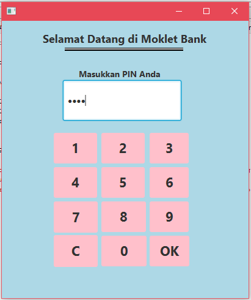
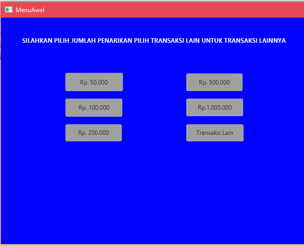
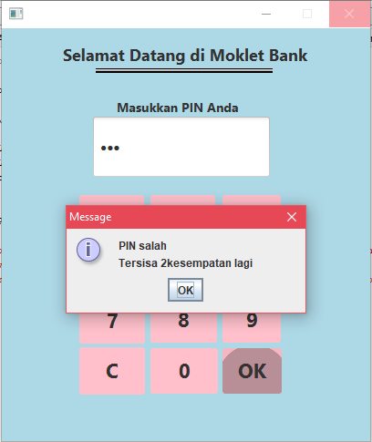

# projectATMjavaFX

1.program ini seperti mesin atm, yang mana user memasukkan pinnya terlebih dahulu.

2.jika pin sudah berhasil, tampilan akan ditujukan kepada transaksi tarik tunai atau transaksi lainnya.

3.jika pin yang dimasukkan salah akan terdapat peringatan, dan diberikan kesempatan 3 kali untuk mencoba memasukkan pinnya kembali.
